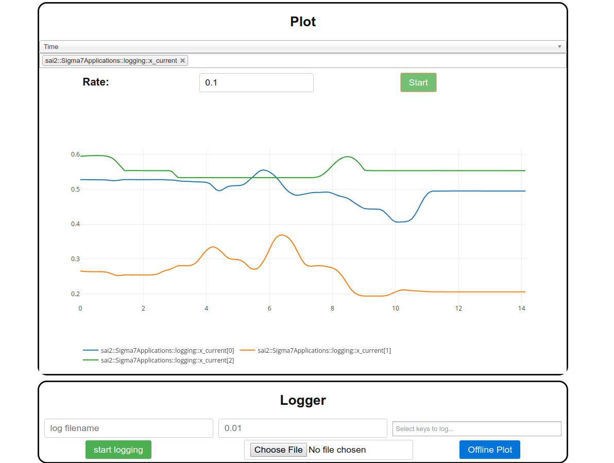

# sai2-interfaces

sai2-interfaces is intended to enable SAI2 developers to quickly build a user-friendly interface to debug or interact with a robot. It is split into two parts: the frontend (HTML/CSS/JS) and the backend server.

## Quickstart
We currently fully support Chrome/Chromium, and have partial support for Firefox. All features except the trajectory generation module work on Firefox. The backend server requires Python 3.5+.

### Installing Dependencies
The backend server depends on [redis](https://pypi.org/project/redis/), [Flask](https://pypi.org/project/Flask/), and [click](https://pypi.org/project/click/). You can install them as below:
```
pip3 install -r interface/requirements.txt
```

### Running a template
sai2-interfaces provides a set of simple, universal templates. In our case, we're going to bring up an interface with a plot and a logger. From the top level of our repo:
```
python3 interface/server.py templates/plot_logger.html
```

Let's open up `localhost:8000`, and if you see this:


Great! It works! From there, you can examine available redis keys or log some redis keys to a file. Here's what it could look like:




### Exporting sai2-interfaces
We use cmake to make sai2-interfaces available to other projects, such as [sai2-examples](https://github.com/manips-sai-org/sai2-examples). You can run the following commands to export definitions to other projects:

```
mkdir build && cd build
cmake ..
```

This project exports `${SAI2-INTERFACES_UI_DIR}`, which points to the absolute path of the interface/ folder in this repository. You can then use cmake's `FILE(COPY)` macro to copy it with your binaries.

### Documentation
For additional resources on how to use sai2-interfaces, see the documentation [here](docs/README.md).

## License
Currently pending licensing. PLEASE DO NOT DISTRIBUTE.

## Project contributors
* Keven Wang
* Mikael Jorda
* William Jen
