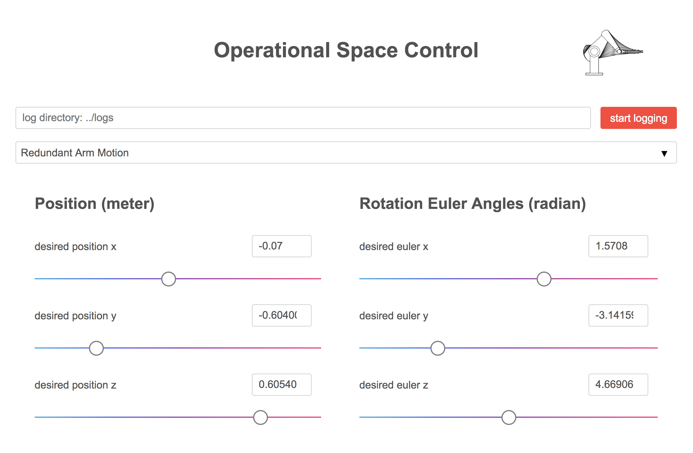

## Project name: sai2-interface

### Project description:
This library implements a web-app graphical user interface to set redis key values

The currently supported browser is Chrome (Chromium) and Firefox 59+. The supported server run time is python3.



### Sample usage
To run the example:

```
# build the sample controller
cd sai2-interfaces/examples
mkdir build
cd build
cmake ..
make -j 4

# run server
cd sai2-interfaces/ui
python3 server/server.py
```

### Project contributors:
* Keven Wang
* Mikael Jorda