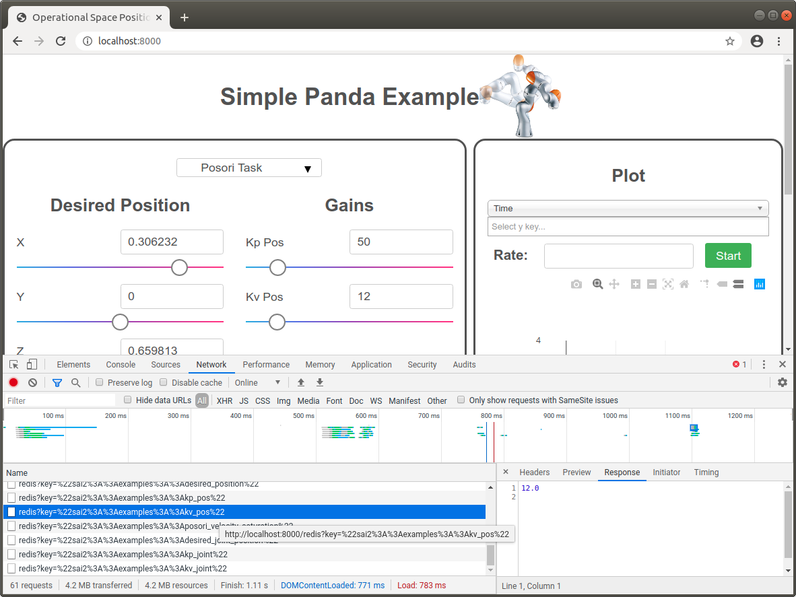

Fundamentals
============

## Redis
Redis is an in-memory key-value store. In other words, think of it like a global, persistent dictionary or map on your computer. 


### Installation
First, let's make sure you have Redis installed on your computer. If you have Ubuntu, the following command should work:

```
sudo apt install redis-server
```

On a fresh install, redis-server should be already be running in the background. Verify this below:
```
wjen@wjen-desktop:~/sai2/core$ sudo systemctl status redis-server
● redis-server.service - Advanced key-value store
   Loaded: loaded (/lib/systemd/system/redis-server.service; enabled; vendor pr
   Active: active (running) since Mon 2020-03-30 04:35:44 PDT; 8h ago
     Docs: http://redis.io/documentation,
           man:redis-server(1)
 Main PID: 1132 (redis-server)
    Tasks: 4 (limit: 4915)
   CGroup: /system.slice/redis-server.service
           └─1132 /usr/bin/redis-server 127.0.0.1:6379

Mar 30 04:35:44 wjen-desktop systemd[1]: Starting Advanced key-value store...
Mar 30 04:35:44 wjen-desktop systemd[1]: redis-server.service: Can't open PID f
Mar 30 04:35:44 wjen-desktop systemd[1]: Started Advanced key-value store.
wjen@wjen-desktop:~/sai2/core$ 
```

If you see a green light, you're ready. If not, run the following:
```
wjen@wjen-desktop:~/sai2/core$ sudo systemctl start redis-server
```

Verify that the systemd service is running. If that still doesn't work, open a new terminal and invoke `redis-server` manually:
```
wjen@wjen-desktop:~/sai2/core$ redis-server
24919:C 30 Mar 13:18:22.412 # oO0OoO0OoO0Oo Redis is starting oO0OoO0OoO0Oo
24919:C 30 Mar 13:18:22.412 # Redis version=4.0.9, bits=64, commit=00000000, modified=0, pid=24919, just started
24919:C 30 Mar 13:18:22.412 # Warning: no config file specified, using the default config. In order to specify a config file use redis-server /path/to/redis.conf
24919:M 30 Mar 13:18:22.414 # You requested maxclients of 10000 requiring at least 10032 max file descriptors.
24919:M 30 Mar 13:18:22.414 # Server can't set maximum open files to 10032 because of OS error: Operation not permitted.
24919:M 30 Mar 13:18:22.414 # Current maximum open files is 4096. maxclients has been reduced to 4064 to compensate for low ulimit. If you need higher maxclients increase 'ulimit -n'.
                _._                                                  
           _.-``__ ''-._                                             
      _.-``    `.  `_.  ''-._           Redis 4.0.9 (00000000/0) 64 bit
  .-`` .-```.  ```\/    _.,_ ''-._                                   
 (    '      ,       .-`  | `,    )     Running in standalone mode
 |`-._`-...-` __...-.``-._|'` _.-'|     Port: 6379
 |    `-._   `._    /     _.-'    |     PID: 24919
  `-._    `-._  `-./  _.-'    _.-'                                   
 |`-._`-._    `-.__.-'    _.-'_.-'|                                  
 |    `-._`-._        _.-'_.-'    |           http://redis.io        
  `-._    `-._`-.__.-'_.-'    _.-'                                   
 |`-._`-._    `-.__.-'    _.-'_.-'|                                  
 |    `-._`-._        _.-'_.-'    |                                  
  `-._    `-._`-.__.-'_.-'    _.-'                                   
      `-._    `-.__.-'    _.-'                                       
          `-._        _.-'                                           
              `-.__.-'                                               

24919:M 30 Mar 13:18:22.414 # WARNING: The TCP backlog setting of 511 cannot be enforced because /proc/sys/net/core/somaxconn is set to the lower value of 128.
24919:M 30 Mar 13:18:22.414 # Server initialized
24919:M 30 Mar 13:18:22.414 # WARNING overcommit_memory is set to 0! Background save may fail under low memory condition. To fix this issue add 'vm.overcommit_memory = 1' to /etc/sysctl.conf and then reboot or run the command 'sysctl vm.overcommit_memory=1' for this to take effect.
24919:M 30 Mar 13:18:22.414 # WARNING you have Transparent Huge Pages (THP) support enabled in your kernel. This will create latency and memory usage issues with Redis. To fix this issue run the command 'echo never > /sys/kernel/mm/transparent_hugepage/enabled' as root, and add it to your /etc/rc.local in order to retain the setting after a reboot. Redis must be restarted after THP is disabled.
24919:M 30 Mar 13:18:22.414 * Ready to accept connections
```

### Basic Operations
Now that Redis is installed, let's go through some core commands that you will use.

Let's set the stage by running the [writekeys.py](./writekeys.py):
```
wjen@wjen-desktop:~/sai2/core/sai2-interfaces$ python3 docs/00-fundamentals/writekeys.py 
wjen@wjen-desktop:~/sai2/core/sai2-interfaces$ 
```

This script has written some data into the Redis database, but we have no idea what. Let's run our first command:
```
wjen@wjen-desktop:~/sai2/core/sai2-interfaces$ redis-cli
127.0.0.1:6379> KEYS *
1) "sai2::redis::bananas"
2) "sai2::redis::oranges"
3) "sai2::redis::apples"
127.0.0.1:6379> 
```

The KEYS command lists what keys are in Redis. The syntax is `KEYS [pattern]`. The pattern string is usually a string that has the `*` wildcard character. So if I say `sai2::*::key`, this pattern would match `sai2::abc::key` and `sai2::abcdef::key`.

Now that we know what keys are available, let's get the value of one of these keys. Since it's first, let's look at `sai2::redis::bananas`:

```
127.0.0.1:6379> GET sai2::redis::bananas
"2"
127.0.0.1:6379> 
```

The value of this key is the string "2". Redis has no concept of types: everything is stored as a string. Now let's modify this key's value:
```
127.0.0.1:6379> SET sai2::redis::bananas bananas
OK
127.0.0.1:6379> 
```

We have now set the Redis key `sai2::redis::bananas` to have a value of "bananas". Note that the SET command can create Redis key-value pairs; the key does not need to exist before you run the SET command.

What if we wanted to view the contents of multiple keys? We can use the MGET command! So let's view all of the keys listed from the earlier `KEYS *` command:
```
127.0.0.1:6379> MGET sai2::redis::bananas sai2::redis::oranges sai2::redis::apples
1) "bananas"
2) "3"
3) "1"
127.0.0.1:6379> 
```

The output of the MGET command follows the order in which you input the keys. So the first line `1) "bananas"` corresponds to the key `sai2::redis::bananas`, and so on.

Similarly, we can modify multiple Redis key-value pairs using the MSET command:
```
127.0.0.1:6379> MSET sai2::redis::bananas 1 sai2::redis::oranges 2 sai2::redis::apples 3
OK
127.0.0.1:6379> MGET sai2::redis::bananas sai2::redis::oranges sai2::redis::apples
1) "1"
2) "2"
3) "3"
127.0.0.1:6379> 
```

We have now covered the core commands (GET/SET/MGET/MSET) that you can use to work with Redis keys. 

If you are ever in a situation where you want to start with a clean Redis database, you can use the FLUSHALL command, which will wipe out all the key-value pairs in Redis:

```
127.0.0.1:6379> KEYS *
1) "sai2::redis::bananas"
2) "sai2::redis::oranges"
3) "sai2::redis::apples"
127.0.0.1:6379> FLUSHALL
OK
127.0.0.1:6379> KEYS *
(empty list or set)
127.0.0.1:6379> 
```

Type in "quit" or send CTRL+D (EOF) to exit `redis-cli`.

For more information on the commands covered in this section:
* [KEYS](https://redis.io/commands/keys)
* [GET](https://redis.io/commands/get)
* [SET](https://redis.io/commands/set)
* [MGET](https://redis.io/commands/mget)
* [MSET](https://redis.io/commands/mset)
* [FLUSHALL](https://redis.io/commands/flushall)

### SAI Redis Conventions
There are a couple of Redis conventions when writing a SAI program. Keys are typically namespaced, e.g. `sai2::interfaces::tutorial::key_name`. This avoids conflicts with other applications who may use the same key names.

Because all values in Redis are strings, we use JSON to serialize numbers, vectors, and matrices. Examples:
```
wjen@wjen-desktop:~/sai2/core/sai2-interfaces$ redis-cli
127.0.0.1:6379> KEYS *
1) "sai2::interfaces::tutorial::vector_key"
2) "sai2::interfaces::tutorial::scalar_key"
3) "sai2::interfaces::tutorial::matrix_key"
127.0.0.1:6379> MGET sai2::interfaces::tutorial::scalar_key sai2::interfaces::tutorial::vector_key sai2::interfaces::tutorial::matrix_key
1) "8.206620897641367"
2) "[6.851870215604476, 2.1029221506516516, 1.1095839118932904, 0.011003444282613462]"
3) "[[7.5883954560722255, 9.799527232067836, 4.611120291703585, 8.988172974436225], [6.191392604661857, 0.4093771175738614, 4.233489255610024, 6.654460943264885], [1.8534865739395334, 2.106126402048827, 5.172664018630291, 5.68907076006051], [0.2101737811965776, 7.818571685472374, 6.8076501360884905, 6.909170716320676]]"
127.0.0.1:6379> 
```

## Web Development Basics
In this section, we will talk about HTML and CSS since knowledge of both topics
is needed to create custom interfaces using modules from SAI2-Interfaces. This
tutorial is not intended to be exhaustive or impart good web programming practices,
but rather give a workable template to create an interface using sai2-interfaces.

### Hypertext Markup Language (HTML)
Let's start with a blank SAI2-Interfaces interfaces HTML document:
```
<!DOCTYPE html>
<html>
  <head>
    <meta charset="UTF-8">
    
    <!-- TODO: Your title goes here -->
    <title>TITLE</title>

    <!-- Global and utility stylesheets -->
    <link rel="stylesheet" href="./css/picnic.min.css" type="text/css">
    <link rel="stylesheet" href="./css/range_input.css" type="text/css">
    <link rel="stylesheet" href="./css/global_styles.css" type="text/css">
    <link rel="stylesheet" href="./css/chosen.min.css" type="text/css">

    <!-- External library includes -->
    <script src="./js/library/jquery-3.3.1.min.js" type="text/javascript"></script>
    <script src="./js/library/chosen.jquery.min.js" type="text/javascript"></script>
    <script src="./js/library/plotly.min.js" type="text/javascript"></script>
    <script src="./js/library/socket.io.js" type="text/javascript"></script>

    <!-- global execution scripts -->
    <script type="module" src="./js/index.js"></script>

    <!-- TODO: Layout CSS -->
    <style>
    </style>
  </head>
  <body>
    <!-- TODO: Your interface goes here -->
  </body>
</html>
```

If you're creating a new interface, start from this. Let's walk through this 
section by section.

The first line: `<!DOCTYPE html>` is the standard identifier for HTML documents.

The next line, we have `<html>...</html>`. This is the parent HTML element. 
These are also called _tags_. Most HTML tags have an opening tag `<html>` and a closing tag `</html>`.

Let's look at the `<head>` element. The `<head>` element is used for document
metadata and loading resources. 


The `<meta charset="UTF-8">` declares the character encoding of the document. The `charset="UTF-8` is called an _attribute_ of the `meta` tag or element. 

Next, the `<title>` element. This is what is shown on the tab of your browser. You should customize this for your interface.
```
<!-- TODO: Your title goes here -->
<title>TITLE</title>
```

The below snippet is split into two parts. The first part is CSS stylesheets and mostly from external libraries. The second chunk is JavaScript library imports that sai2-interfaces uses.  Finally, the last chunk imports everything from sai2-interfaces. In general, when you're creating a new interface, just copy this in.
```
<!-- Global and utility stylesheets -->
<link rel="stylesheet" href="./css/picnic.min.css" type="text/css">
<link rel="stylesheet" href="./css/range_input.css" type="text/css">
<link rel="stylesheet" href="./css/global_styles.css" type="text/css">
<link rel="stylesheet" href="./css/chosen.min.css" type="text/css">

<!-- External library includes -->
<script src="./js/library/jquery-3.3.1.min.js" type="text/javascript"></script>
<script src="./js/library/chosen.jquery.min.js" type="text/javascript"></script>
<script src="./js/library/plotly.min.js" type="text/javascript"></script>
<script src="./js/library/socket.io.js" type="text/javascript"></script>

<!-- global execution scripts -->
<script type="module" src="./js/index.js"></script>
```

The style allows you the customize the look and feel of your interface. You will be writing CSS code in this tag - see the next section on what this will look like.
```
<!-- TODO: Layout CSS -->
<style>
</style>
```

Finally, the `<body>` tag is where you'll be placing your actual interface elements and controls. 
```
<body>
  <!-- TODO: Your interface goes here -->
</body>
```

### HTML Elements Table
Although we covered the core HTML document structure, there are several HTML elements that you should be familiar with when building your own interface. We have tabulated common ones here.

| Element Name | Description/Usage |
|--------------|-------------------|
|`<h1>`, `<h2>`, `<h3>`, `<h4>`, `<h5>`, `<h6>`| Used for section headings. `<h1>` is the biggest and `<h6>` is the smallest. |
|`<label>`| Use this to label the meaning of another adjacent element.|
|`<div>`| Container HTML element - group items that belong together in this element.|
|`<p>`| A paragraph element. Use this for longer text.|
|`<br>`| Puts a line break in your HTML. Useful for forcing things onto a new line.|

See a full reference [here](https://developer.mozilla.org/en-US/docs/Web/HTML/Element). 


### Cascading Style Sheets (CSS)
CSS is a rule-based language where you specify what you want to do to a specific group of elements. For example,

```
body {
  background: red;
}
```

What we are doing here is creating a rule that looks for all `<body>` tags and sets the property `background` to the value `red`. In plain English, set the background of the body of the HTML document to have a red background.

Suppose I have a HTML document like this:
```
<body>
  <div>
    <label>Inside</label>
  </div>
  <label>Outside</label>
</body>
```

I could define the following CSS rules to style the `<label>` elements:
```
label {
  color: red;
}
```

But what if I only wanted to modify the "Inside" label? I can declare my rule like this:
```
div label {
  color: red;
}
```

In plain English, this CSS rule says to look for all labels that have a div as its direct parent, and then color that label red. 

The limitation of the above that it will always match elements of that specification. What if we wanted only certain labels that we specify to have a specific styling? We can use a CSS class in this case.

```
.custom-class {
  color: red;
}
```
Accompanying HTML code:
```
<body>
  <label class="custom-class">Custom<label>
  <label>Default</label>
</body>
```

We create a CSS class by appending a period `.` in front of the name. We apply the CSS class to a HTML element by setting the `class` attribute like above. 

There are a lot of CSS properties and thus impossible to memorize. If you are styling your interface, you will need a CSS property reference, like the one [MDN](https://developer.mozilla.org/en-US/docs/Web/CSS/Reference) provides or [W3C Schools](https://www.w3schools.com/cssref/).


### CSS Layouts
CSS is also used for HTML layout. If you want to center something, or split something into columns, etc, you will need to use CSS. There are two primary layout methods: Flexbox and Grid. We will cover both briefly and provide additional reference information.

### CSS Flexbox


Additional information from [W3C](https://www.w3schools.com/css/css3_flexbox.asp)

### CSS Grid

Additional information from [W3C](https://www.w3schools.com/css/css_grid.asp)

## Debugging

### HTML and CSS
As with any programing language, you will always have some bugs that you will
need to fix. Usually, say in Python or C++, you'll have print statements,
asserts, exceptions, etc. However, if your webpage or interface doesn't look 
right, a print statement isn't going to help.

Luckily, a HTML/CSS debugger is bundled within your browser! If you hit F12 on
Firefox or Chrome, a subwindow will open, exposing the HTML and CSS. If you 
hover over an element, the debugger will show the relevant CSS and shade where
the element is on the actual webpage. You can also edit the CSS directly on
the page, which can help you iterate faster.


### The Network
You may run into issues where a Redis key might not be found or returning the
correct value in your interface. In this case, you may want to look at the network
request that the UI makes to Redis. You can do this by switching to the Network
tab and looking for a URL like `redis?key=%22sai2%3A%3Aexamples%3A%3Aposori_velocity_saturation%22`.
The interface queries Redis keys in the URL format like `localhost:8000/redis?key=<your key here>`.
The below image is looking at a query for the Redis key `sai2::examples::posori_velocity_saturation`.



### JavaScript
If you find yourself in a position where you need to jump into the internals of
sai2-interfaces, you will find the JavaScript debugger helpful. You will need to 
navigate to the Sources tab and look for the relevant JavaScript file(s). From
here, it is a standard debugger that you would normally find, like gdb. Set
breakpoints, step, continue, etc. Please see additional debugging resources
on how to use the JavaScript debugger as it is out of scope of this tutorial.

### Additional Debugging Resources
* [Mozilla Firefox Dev Tools: Page Inspector](https://developer.mozilla.org/en-US/docs/Tools/Page_Inspector)
* [Mozilla Firefox Dev Tools: JavaScript Debugger](https://developer.mozilla.org/en-US/docs/Tools/Debugger)
* [Mozilla Firefox Dev Tools: NetworkMonitor](https://developer.mozilla.org/en-US/docs/Tools/Network_Monitor)
* [Google Chrome Dev Tools: CSS](https://developers.google.com/web/tools/chrome-devtools/css)
* [Google Chrome Dev Tools: Network](https://developers.google.com/web/tools/chrome-devtools/network)
* [Google Chrome Dev Tools: JavaScript](https://developers.google.com/web/tools/chrome-devtools/javascript)


## Additional Resources
If you would like to learn more about these technologies, there are a plethora of
tutorials and references online. A couple of recommended tutorials/references
are below.

* [Mozilla Developer Network (MDN)](https://developer.mozilla.org/en-US/docs/Learn) 
* [W3C Schools](https://www.w3schools.com/)
