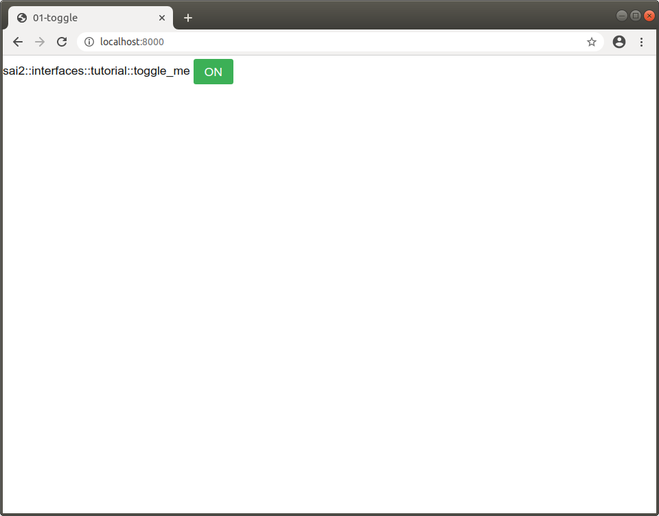
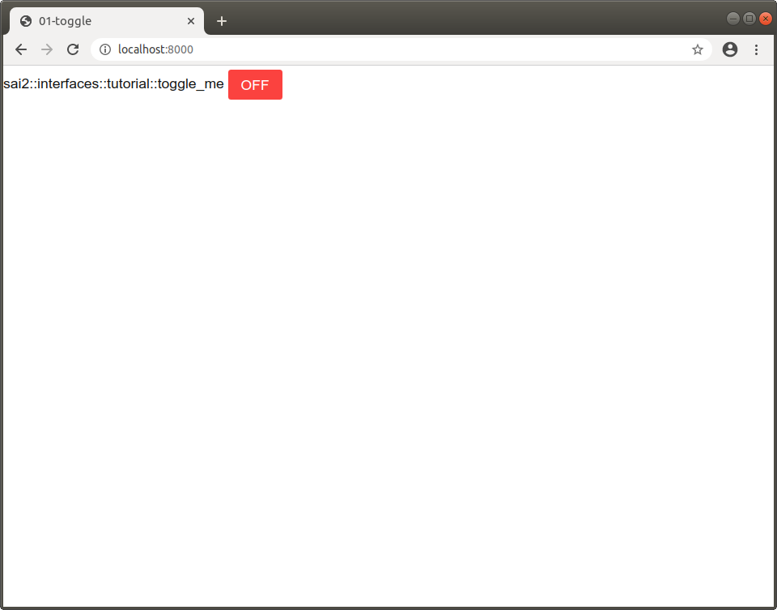
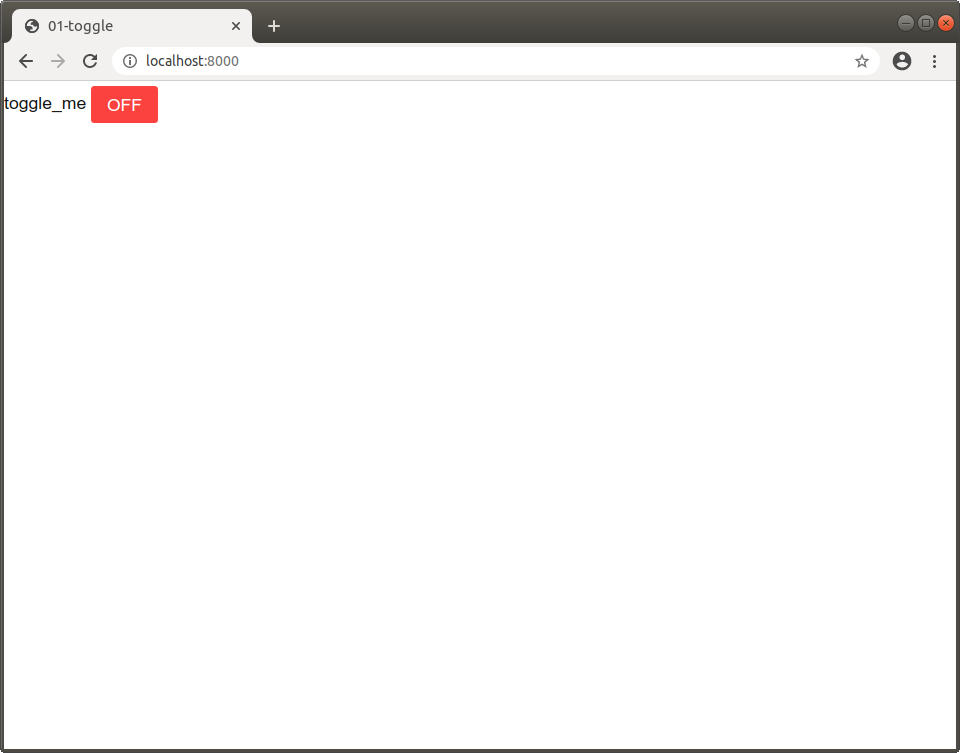

The `sai2-interfaces-toggle` Element
====================================
The `sai2-interfaces-toggle` element allows you to toggle a Redis key between 0 (false) and 1 (true). 

## Usage
```
<sai2-interfaces-toggle></sai2-interfaces-toggle>
```

## Attributes
* `key`: Required. Specifies which Redis key to get/set for toggling.
* `display`: Optional. Specifies what text to put next to the toggle button. Default is the key name.

## Example
Open up `redis-cli`, and let's set the key `sai2::interfaces::tutorial::toggle_me` to the value 1:
```
wjen@wjen-desktop:~$ redis-cli
127.0.0.1:6379> set sai2::interfaces::tutorial::toggle_me 1
OK
127.0.0.1:6379> get sai2::interfaces::tutorial::toggle_me
"1"
127.0.0.1:6379> 
```

Now let's see the toggle element in action. If we put the following in the `<body></body>` tags of [01-toggle.html](./01-toggle.html):
```
<sai2-interfaces-toggle key="sai2::interfaces::tutorial::toggle_me">
</sai2-interfaces-toggle>
```

and then we run the following in a separate terminal at the `sai2-interfaces` repository root:
```
wjen@wjen-desktop:~/sai2/core/sai2-interfaces$ python3 interface/server.py docs/01-toggle/01-toggle.html 
 * Restarting with stat
 * Debugger is active!
 * Debugger PIN: 142-257-956
```

Open your browser to `localhost:8000` and we should be able to see our toggle button set to "ON".



Now click the "ON" button. You should see that the toggle button has switched to "OFF".



We can verify that the value of "0" has been written to Redis.
```
127.0.0.1:6379> get sai2::interfaces::tutorial::toggle_me
"0"
127.0.0.1:6379> 
```

Now let's customize the display name by specifying the `display` attribute. Let's edit the `<sai2-interfaces-toggle>` element [01-toggle.html](./01-toggle.html) to the following:
```
<sai2-interfaces-toggle display="toggle_me" key="sai2::interfaces::tutorial::toggle_me">
</sai2-interfaces-toggle>
```

Refresh your browser, and you should see the customized text.


