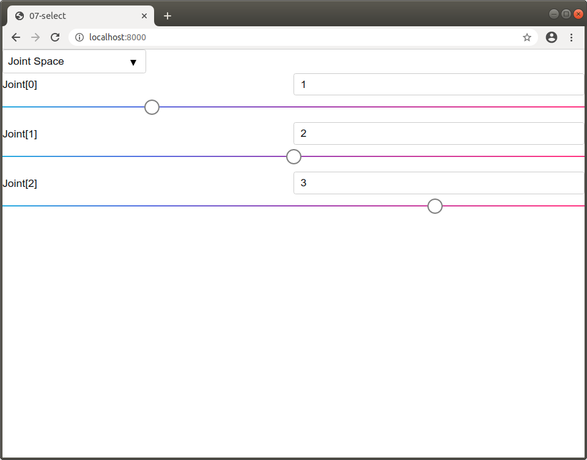
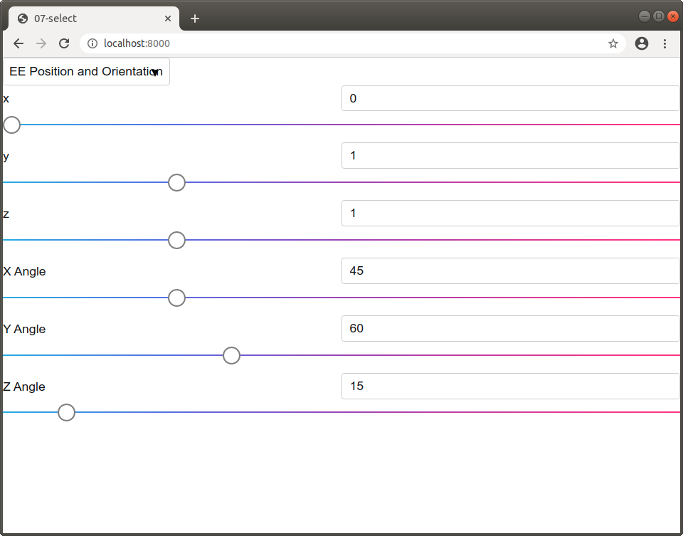

The `sai2-interfaces-select` Element
====================================
The `sai2-interfaces-select` element is a container that shows different groups 
of elements based on what is selected in a dropdown menu. The currently selected
value is tied to a Redis key.

More concretely, imagine there is a dropdown with values A and B. If I select 
"A" in the dropdown, group A elements will become visible. If I select "B", 
group B elements will become visible and group A elements will be hidden. 


## Usage
```
<sai2-interfaces-select currentPrimitiveKey="...">
  <sai2-interfaces-select-option name="..." key="...">
    <element></element>
    <element></element>
    <element></element>
    ...
  </sai2-interfaces-select-option>
  <sai2-interfaces-select-option name="..." key="...">
    <element></element>
    <element></element>
    <element></element>
    ...
  </sai2-interfaces-select-option>
  <sai2-interfaces-select-option name="..." key="...">
    <element></element>
    <element></element>
    <element></element>
    ...
  </sai2-interfaces-select-option>
  ...
</sai2-interfaces-select>
```

The top level element must be `sai2-interfaces-select`. Each dropdown value is 
represented with a `sai2-interfaces-select-option` element, and the associated 
HTML elements are children of the `sai2-interfaces-select-option` element.

## Attributes
### The `sai2-interfaces-select` element
* `currentPrimitiveKey`: Required. This key stores the current value of the 
dropdown and thus the currently displayed group of elements. If this Redis key 
does not exist, an error will be thrown.

### The `sai2-interfaces-select-option` element
* `name`: Required. The friendly name to put within the dropdown.
* `key`: Required. The value to set within Redis. If this Redis key does not 
exist, an error will be thrown.

## Example
Suppose we have a 3-DOF robot that we want to control. We want to be able to 
change each joint's value in the "joint" mode but the end-effector position and
orientation in the "posori" mode. We can achieve this using the 
`sai2-interfaces-select` element.

We will define the following keys:
* `sai2::interfaces::tutorial::mode` - will either be `joint` or `posori`.
* `sai2::interfaces::tutorial::q` - the joint angles
* `sai2::interfaces::tutorial::ee_pos` - the end effector position
* `sai2::interfaces::tutorial::ee_ori` - the end effector orientation

We can initialize each of the keys with the provided 
[writekeys.py script](./writekeys.py):
```
wjen@wjen-desktop:~/sai2/core/sai2-interfaces$ python3 docs/07-select/writekeys.py 
wjen@wjen-desktop:~/sai2/core/sai2-interfaces$ 
```

The HTML for this will look like this. Do not sweat the values - they are 
nonsensical.
```
<sai2-interfaces-select currentPrimitiveKey="sai2::interfaces::tutorial::mode">
  <sai2-interfaces-select-option name="Joint Space" key="joint">
    <sai2-interfaces-slider key="sai2::interfaces::tutorial::q" 
      display="Joint" min="0" max="4" step="0.1">
    </sai2-interfaces-slider>
  </sai2-interfaces-select-option>
  <sai2-interfaces-select-option name="EE Position and Orientation" key="posori">
    <sai2-interfaces-slider key="sai2::interfaces::tutorial::ee_pos" 
      display='["x","y","z"]' min="0" max="4" step="0.1">
    </sai2-interfaces-slider>
    <sai2-interfaces-slider key="sai2::interfaces::tutorial::ee_ori" 
      display='["X Angle","Y Angle","Z Angle"]' min="0" max="180" step="1">
    </sai2-interfaces-slider>
  </sai2-interfaces-select-option>
</sai2-interfaces-select>
```

It should look something like this:



We see that the default value for our mode (`joint`) shows the joint angles but 
not the posori sliders. Expand the dropdown and select 
"EE Position and Orientation" and the screen should change to the following:


