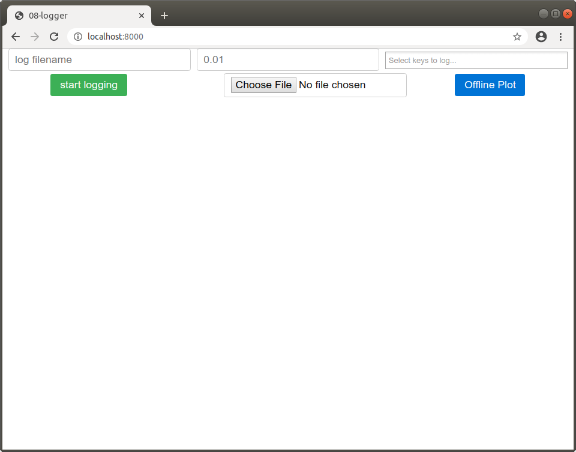
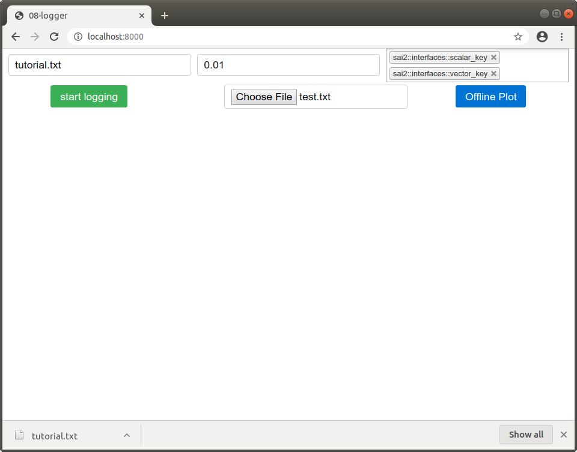
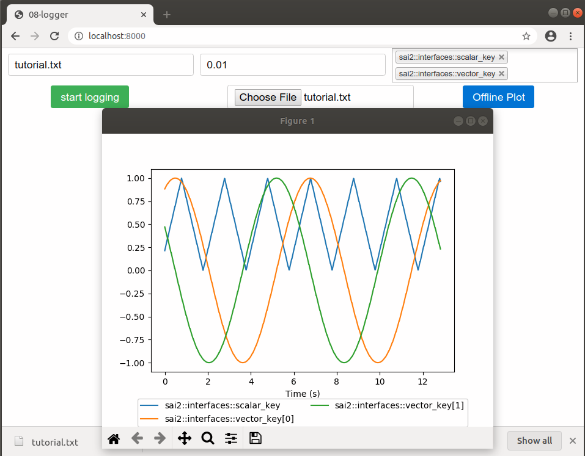

The `sai2-interfaces-logger` Element
====================================
The `sai2-interfaces-logger` element allows you to write various scalar or 
vector-valued Redis keys to a file along with a timestamp.

The logger is a composite element, meaning that it has several subelements, and 
looks like this:



The first input text field is where you specify the desired log file name, the 
middle input text field is how often you want to write to the log file, and the 
third is which Redis keys you would like to write to the log file. 

On the second row, the first button controls when to start/stop logging. The 
next two elements ("Choose File" and "Offline Plot") lets you select an already 
created log file and creates a plot for the data contained within that log file.


## Usage
```
<sai2-interfaces-logger>
</sai2-interfaces-logger>
```

## Attributes
There are no attributes for this element.

## Example

Let's start by first running the provided [writekeys.py](./writekeys.py) script:
```
wjen@wjen-desktop:~/sai2/core/sai2-interfaces$ python3 docs/08-logger/writekeys.py 
Writing keys...
```

Now let's start up the interface:
```
wjen@wjen-desktop:~/sai2/core/sai2-interfaces$ python3 interface/server.py docs/08-logger/08-logger.html 
 * Restarting with stat
 * Debugger is active!
 * Debugger PIN: 142-257-956
(22064) wsgi starting up on http://127.0.0.1:8000
```

If we open up our browser, we should see something like this:


Let's fill in the fields:
* Put whatever filename you want as the log filename. I'm going to use 
`tutorial.txt`.
* Let's write data at a period of `0.01` seconds.
* Let's write the keys `sai2::interfaces::tutorial::scalar_key` and 
`sai2::interfaces::tutorial::vector_key`. You can search in the textbox starting
from anywhere in those strings, so you should be able to find it if you type in 
"scalar_key" and "vector_key".

Then, hit "start logging" and let it run for a few seconds, and then click 
"stop logging". You should see a downloaded file.



After that, let's plot our data by going to the "Choose file", and selecting our
freshly created `tutorial.txt` file. Then hit the "Offline Plot" button, and you
should see a plot come up with the data:

