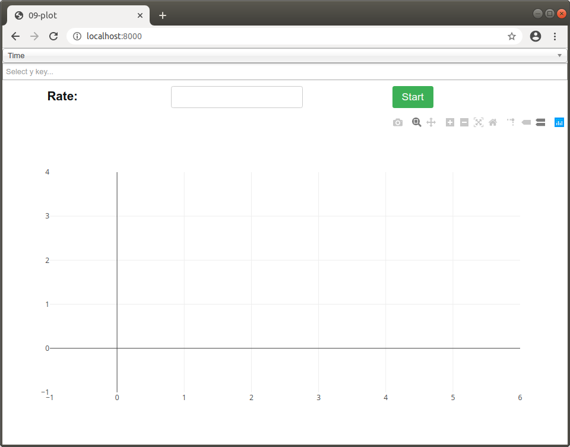
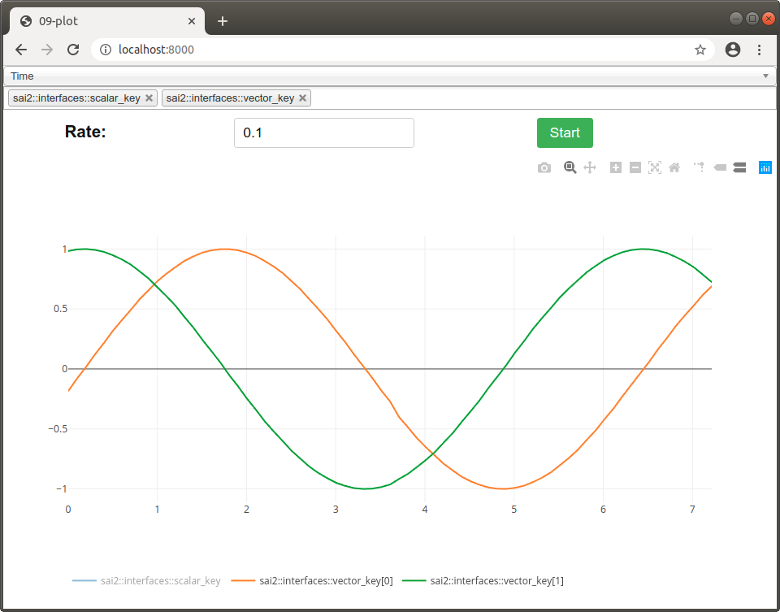

The `sai2-interfaces-plot` Element
====================================
The `sai2-interfaces-plot` element allows you to plot scalar-valued and vector-valued Redis keys against time. 



At the top, the first dropdown menu represents the key for the x-axis, which is by default "Time". Although you _can_  select other keys to function as the x-axis, `sai2-interfaces-plot` probably won't work or work the way you'd expect. So don't touch it.

Below it is the y-axis keys. Select any number of vector-valued and scalar keys to plot.

And then there's the Rate input, which is how often to refresh the plot in seconds. There is a maximum refresh rate of 0.033s, so you won't get any better plot resolution if you put a refresh rate faster than that. H

Hit "Start" to start plotting, and hit "Stop" to stop plotting. Within the plot window itself, there are various controls, such as zooming and saving to an image. That's pretty much it!

## Usage
```
<sai2-interfaces-plot>
</sai2-interfaces-plot>
```

## Attributes
There are no attributes for this element.

## Example

Let's start by first running the provided [writekeys.py](./writekeys.py) script:
```
wjen@wjen-desktop:~/sai2/core/sai2-interfaces$ python3 docs/09-plot/writekeys.py 
Writing keys...
```

Now let's start up the interface:
```
wjen@wjen-desktop:~/sai2/core/sai2-interfaces$ python3 interface/server.py docs/09-plot/09-plot.html 
 * Restarting with stat
 * Debugger is active!
 * Debugger PIN: 142-257-956
(22855) wsgi starting up on http://127.0.0.1:8000
```

You should see something like this:


Then, select the keys `sai2::interfaces::tutorial::scalar_key` and `sai2::interfaces::tutorial::vector_key` and a rate of `0.1`. Hit "Start" to begin plotting, and click "Stop" when done.


You can save the plot, zoom in, and more on the top right menu of the plot itself. If you want to single out certain elements of the plot, you can click on the appropriate element in the legend on the bottom of the plot to toggle it on and off.


