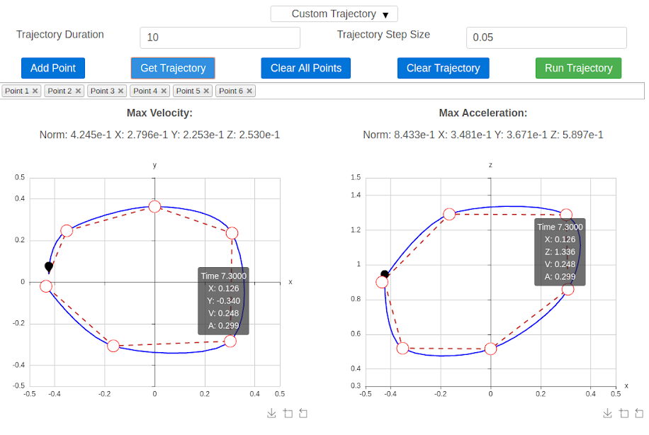

The `sai2-interfaces-trajectory-select` Element
===============================================
The `sai2-interfaces-trajectory-select` element allows users to specify 
waypoints for the robot end effector to follow. The user must specify the total 
trajectory duration in seconds as well as the timestep between waypoints. In the
 image below, we specify a total trajectory duration of 10 seconds but with the 
 robot end effector desired position is specified at every 0.05 seconds.

There are two plots: the left is the x-y plane and the right is the x-z plane. 
This provides a straightforward interface to define waypoints in 3D space. The 
typical workflow is as follows:

* Add points using the "Add Point" button
* This will create a new point at the origin of both plots. Drag the point to 
the desired position on both the x-y plane and the x-z plane.
* Repeat until all points have been added. If you want to remove a point, you 
can click the "X" button on the listbox underneath all of the buttons.
* Generate a trajectory using the "Get Trajectory" button to see what the actual
 planned trajectory is. The maximum velocity and acceleration along each 
 irection (x, y, z) will be computed, and you can hover over the computed path 
 to see its position, velocity, and acceleration.
* Click "Run Trajectory" to issue commands to the controller.

Convenience functions like "Clear All Points" clears the points and 
"Clear Trajectory" clears any planned trajectories on the plot.

*Note*: This element does not work on Firefox.



## Usage
```
 <sai2-interfaces-trajectory-select xLim="..." yLim="..." zLim="..."
  current_pos_key="..." primitive_key="..."
  primitive_value="..." , position_key="..."
  velocity_key="...">
</sai2-interfaces-trajectory-select>
```

## Attributes
* `xLim`: Required. A 2 element vector, e.g. `[-1, 1]` defining the x limits of 
the robot workspace.
* `yLim`: Required. A 2 element vector, e.g. `[-1, 1]` defining the y limits of 
the robot workspace.
* `zLim`: Required. A 2 element vector, e.g. `[-1, 1]` defining the z limits of 
the robot workspace.
* `current_pos_key`: Required. The Redis key that holds the current end effector
position. If this Redis key does not exist, an error will be thrown.
* `primitive_key`: Required. The Redis key that represents the trajectory 
following mode of a SAI2 controller program. If this Redis key does not exist, 
an error will be thrown.
* `primitive_value`: Required. The value to write into the `primitive_key` 
attribute. Usually means a specific state within the SAI2 controller program.
* `position_key`: Required. The Redis key in which to write each trajectory 
waypoint. If this Redis key does not exist, an error will be thrown.
* `velocity_key`: Required. The Redis key in which to write the desired velocity
at each trajectory waypoint. If this Redis key does not exist, an error will 
be thrown.

## Example
The trajectory generation module requires a SAI2 controller.

Please see [SAI2-Examples: Panda](https://github.com/manips-sai-org/sai2-examples/tree/master/02-redundant_arm) 
and run that example.
Go to the trajectory generation primitive and run it there.
