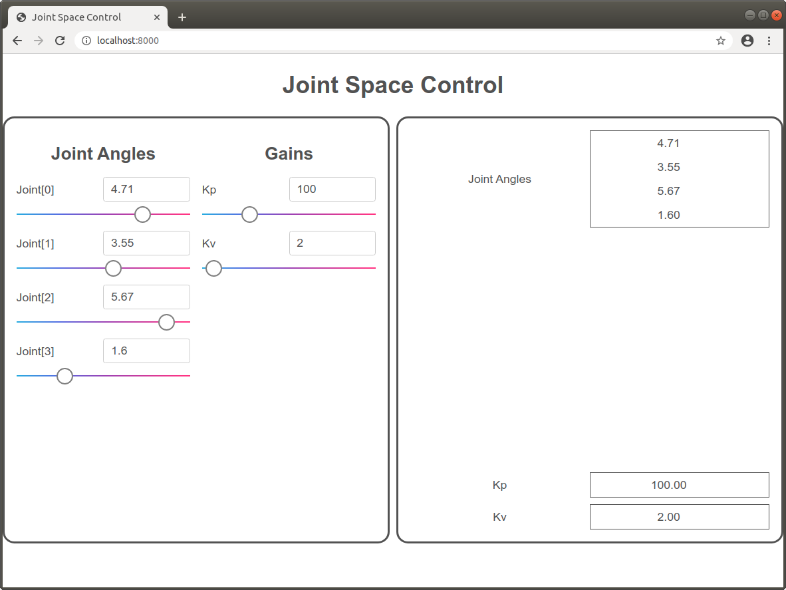
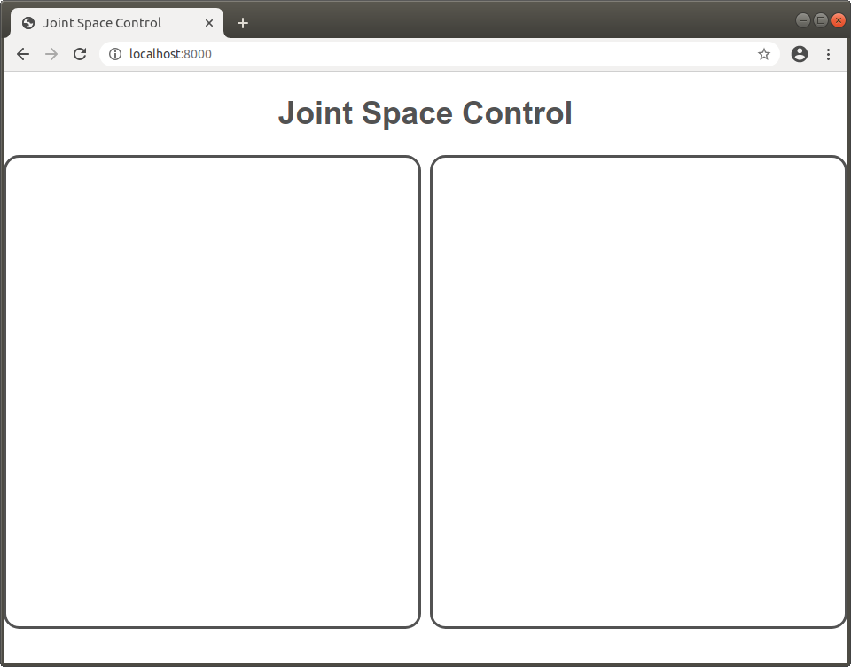
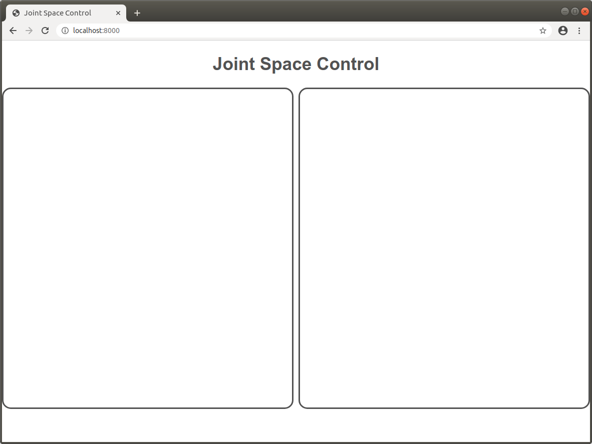

Joint Space Control Tutorial
============================

In this tutorial, we will be building an interface that can set the joint 
angles of a robot and also set the Kp and Kv gains for joint space control.

We define the following keys:
* `sai2::interfaces::tutorial::q`: The robot joint angles - a vector.
* `sai2::interfaces::tutorial::joint_kp`: The position gain - a scalar.
* `sai2::interfaces::tutorial::joint_kv`: The velocity gain - a scalar.

Use the provided [writekeys.py](./writekeys.py) script to initialize random
values for these Redis keys. You will need to specify how many links your robot
has.

For example, if your robot has 3 links, you can invoke the script as follows:
```
wjen@wjen-desktop:~/sai2/core/sai2-interfaces$ python3 tutorials/01-joint/writekeys.py 4
sai2::interfaces::tutorial::q set to b'[6.189100504827702, 3.5546098337738115, 5.678968756270388, 1.6111227671168307]'
sai2::interfaces::tutorial::joint_kp set to b'100'
sai2::interfaces::tutorial::joint_kv set to b'2'
wjen@wjen-desktop:~/sai2/core/sai2-interfaces/tutorials/01-joint$ 
```

We will be building an interface that looks like this:



In the left half, we will be able to change the joint angles and gains. 
The right half will contain a display that will verify that the sliders modify the joint angles.

## Getting Started
Now that we've set up the Redis keys, we start from a fresh HTML file, which looks like this:
```
<!DOCTYPE html>
<html>
  <head>
    <meta charset="UTF-8">
    <title>Joint Space Control</title>
  </head>
  <body>
  </body>
</html>
```
This isn't too exciting - just a title and some other minor HTML tags. 

In order to use the sai2-interfaces, we need to import required materials into the `<head></head>` tag:

```
<!-- Global and utility stylesheets -->
<link rel="stylesheet" href="./css/picnic.min.css" type="text/css">
<link rel="stylesheet" href="./css/range_input.css" type="text/css">
<link rel="stylesheet" href="./css/global_styles.css" type="text/css">
<link rel="stylesheet" href="./css/chosen.min.css" type="text/css">

<!-- External library includes -->
<script src="./js/library/jquery-3.3.1.min.js" type="text/javascript"></script>
<script src="./js/library/chosen.jquery.min.js" type="text/javascript"></script>
<script src="./js/library/plotly.min.js" type="text/javascript"></script>
<script src="./js/library/socket.io.js" type="text/javascript"></script>

<!-- global execution scripts -->
<script type="module" src="./js/index.js"></script>
```

The first part is CSS stylesheets, mostly from external libraries. The second chunk is JavaScript library imports that sai2-interfaces uses.  Finally, the last chunk imports everything from sai2-interfaces. In general, when you're creating a new interface, just copy this in.

Putting this all together, we get:

```
<!DOCTYPE html>
<html>
  <head>
    <meta charset="UTF-8">
    <title>Joint Space Control</title>

    <!-- Global and utility stylesheets -->
    <link rel="stylesheet" href="./css/picnic.min.css" type="text/css">
    <link rel="stylesheet" href="./css/range_input.css" type="text/css">
    <link rel="stylesheet" href="./css/global_styles.css" type="text/css">
    <link rel="stylesheet" href="./css/chosen.min.css" type="text/css">

    <!-- External library includes -->
    <script src="./js/library/jquery-3.3.1.min.js" type="text/javascript"></script>
    <script src="./js/library/chosen.jquery.min.js" type="text/javascript"></script>
    <script src="./js/library/plotly.min.js" type="text/javascript"></script>
    <script src="./js/library/socket.io.js" type="text/javascript"></script>

    <!-- global execution scripts -->
    <script type="module" src="./js/index.js"></script>
  </head>
  <body>
  </body>
</html>
```

## Interface Layout
Now that the imports are taken care of, let's talk about how we want our interface to be organized. For this tutorial, we're going to build something that looks like this:



As seen above, we have a title at the top with two halves into which we can place our sliders. So in this tutorial, we'll be putting `sai2-interfaces-slider` elements in the left half and `sai2-interfaces-display` elements in the right half to make sure we did the tutorial right.

First, we style the body and make a convenience `center` CSS class for centering items:
```
body {
  color: #525252;
  display: flex;
  flex-direction: column;
}

.center {
  text-align: center;
}
```

Since we'll be using [CSS Flexbox](https://developer.mozilla.org/en-US/docs/Learn/CSS/CSS_layout/Flexbox) to organize our interface, we make the body use Flexbox through `display: flex`.


### The Parent Container
Next, let's make the two halves. We do this in a tree fashion - we make a "container" with two equal-sized columns, a "left-container" and a "right-container". We also want to style each side with a rounded, black border.

So let's define the parent "container" first:
```
.container {
  display: grid;
  grid-template-columns: 1fr 1fr;
  gap: 10px;
  justify-content: space-around;
  height: 80vh;
}
```

Here, the parent "container" has `display: grid`, which means to use [CSS Grids](https://developer.mozilla.org/en-US/docs/Web/CSS/CSS_Grid_Layout). CSS Grids makes it easy to define two equal sized columns, which is done via the following `grid-template-columns: 1fr 1fr` line. 

We also specify a small 10px gap between these columns to make the interface look nice. 

The `justify-content` line means to distribute padding evenly around each element in a CSS Grid. It's not too important, but you can read more [here](https://developer.mozilla.org/en-US/docs/Web/CSS/justify-content).

Finally, we specify the parent "container" to have a height of 80% of the window height (viewport height).

Next, we want the left and right containers to have a rounded, black border.
We define the "container-item" CSS class to do this:
```
.container-item {
  border-style: solid;
  border-radius: 1em;
  padding: 1em;
}
```

### The Left Container
Next, let's create the sliders for the joint angles and the gains. Here, we want
two columns: the first column for our joint angles and the second one for our 
gains.

So we replicate most of the same styling for the parent container:
```
.left-container {
  display: grid;
  gap: 1em;
  grid-template-columns: 1fr 1fr;
  grid-template-rows: auto;
}
```

### The Right Container
Recall that the right container is to hold `sai2-interface-display` elements
to verify that we created the joint space interface elements/sliders correctly.
Since we don't need extra columns, we just define a single column and thus 
each element we place in the right container will be on its own row.

```
.right-container {
  display: grid;
  grid-template-columns: 1fr;
  gap: 10px;
}
```

### Verifying the Layout
Let's add in all of the above styling to a `<style></style>` tag in the `<head></head>`:
```
<!DOCTYPE html>
<html>
  <head>
    <meta charset="UTF-8">
    <title>Joint Space Control</title>

    <!-- Global and utility stylesheets -->
    <link rel="stylesheet" href="./css/picnic.min.css" type="text/css">
    <link rel="stylesheet" href="./css/range_input.css" type="text/css">
    <link rel="stylesheet" href="./css/global_styles.css" type="text/css">
    <link rel="stylesheet" href="./css/chosen.min.css" type="text/css">

    <!-- External library includes -->
    <script src="./js/library/jquery-3.3.1.min.js" type="text/javascript"></script>
    <script src="./js/library/chosen.jquery.min.js" type="text/javascript"></script>
    <script src="./js/library/plotly.min.js" type="text/javascript"></script>
    <script src="./js/library/socket.io.js" type="text/javascript"></script>

    <!-- global execution scripts -->
    <script type="module" src="./js/index.js"></script>

    <!-- Example CSS goes here -->
    <style>
      body {
        color: #525252;
        display: flex;
        flex-direction: column;
      }

      .center {
        text-align: center;
      }

      .container {
        display: grid;
        grid-template-columns: 1fr 1fr;
        gap: 10px;
        justify-content: space-around;
        height: 80vh;
      }

      .container-item {
        border-style: solid;
        border-radius: 1em;
        padding: 1em;
      }

      .left-container {
        display: grid;
        gap: 1em;
        grid-template-columns: 1fr 1fr;
        grid-template-rows: auto;
      }

      .right-container {
        display: grid;
        grid-template-rows: 1fr;
        gap: 10px;
      }
    </style>
  </head>
  <body>
  </body>
</html>
```

Now let's add some basic HTML elements to make sure our layout works. We are 
going to add the title, the parent container, and the left and right containers.

Within the `<body></body>` tag, add the following:
```
<body>
  <h2 class="center">Joint Space Control</h2>

  <div class="container">
    <div class="left-container container-item"></div>
    <div class="right-container container-item"></div>
  </div>
</body>
```

Here, we defined a centered title, and then created the parent container with
the left and right containers as its children. If you run the server, you 
should see this:


## Creating the Interface
Now that we have defined all of the styling, we can finally define our interface.

### The Left Container
On the left side, we need to create two columns: one for the joint angles slider
and the other for the gains. So we create two `<div></div>` elements for 
each column.
```
<div class="left-container container-item">
  <div>
    <h2>Joint Angles</h2>
  </div>
  <div>
    <h2>Gains</h2>
  </div>
</div>
```



Let's define the slider for the joint angles:
```
<sai2-interface-slider key="sai2::interfaces::tutorial::q"
  display="Joint" min="0" max="6.28" step="0.01">
</sai2-interface-slider>
```

For this tutorial, we assume that we are dealing with revolute joints only. 
Furthermore, we aren't giving any special names to each joint, so the slider
is going to show something like `Joint[0]` or `Joint[4]`. If this doesn't look
familiar, refer to the [sai2-interfaces-slider documentation](../../docs/04-slider/README.md).

Similarly, let the `Kp` gain go from `[0, 400]` and `Kv` go from `[0, 100]`.
The resultant HTML element looks as such:
```
<sai2-interfaces-slider 
  key="sai2::interfaces::tutorial::joint_kp"
  display="Kp"
  min="0" max="400" step="0.01">
</sai2-interfaces-slider>
<sai2-interfaces-slider 
  key="sai2::interfaces::tutorial::joint_kv"
  display="Kv"
  min="0" max="100" step="0.01">
</sai2-interfaces-slider>
```

Putting the left container together, we get:
```
<div class="container-item left-container center">
  <div>
    <h2>Joint Angles</h2>
    <sai2-interfaces-slider 
      key="sai2::interfaces::tutorial::q"
      display="Joint"
      min="0" max="6.28" step="0.01">
    </sai2-interfaces-slider>
  </div>
  <div>
    <h2>Gains</h2>
    <sai2-interfaces-slider 
      key="sai2::interfaces::tutorial::joint_kp"
      display="Kp"
      min="0" max="400" step="0.01">
    </sai2-interfaces-slider>
    <sai2-interfaces-slider 
      key="sai2::interfaces::tutorial::joint_kv"
      display="Kv"
      min="0" max="100" step="0.01">
    </sai2-interfaces-slider>
  </div>
</div>
```

### The Right Container
The right container is much simpler: we define a `sai2-interfaces-display` element for each of the three keys in this example and just throw them into the right container div.


We arbitrarily choose a refresh rate of 1 refresh per second. We also 
round to two decimal places since our slider step resolution is 0.01.
```
<div class="container-item right-container">
  <sai2-interfaces-display key="sai2::interfaces::tutorial::q" 
    refreshRate="1" display="Joint Angles" decimalPlaces="2">
  </sai2-interfaces-display>
  <sai2-interfaces-display key="sai2::interfaces::tutorial::joint_kp" 
    refreshRate="1" display="Kp" decimalPlaces="2">
  </sai2-interfaces-display>
  <sai2-interfaces-display key="sai2::interfaces::tutorial::joint_kv" 
    refreshRate="1" display="Kv" decimalPlaces="2">
  </sai2-interfaces-display>
</div>
```

## The Finished Interface
You can view the completed HTML in [01-joint.html](./01-joint.html). If you run this file, you should be able to see and drag sliders for each of these values. On the 
right side of the interface, you should see the Redis keys update. 


