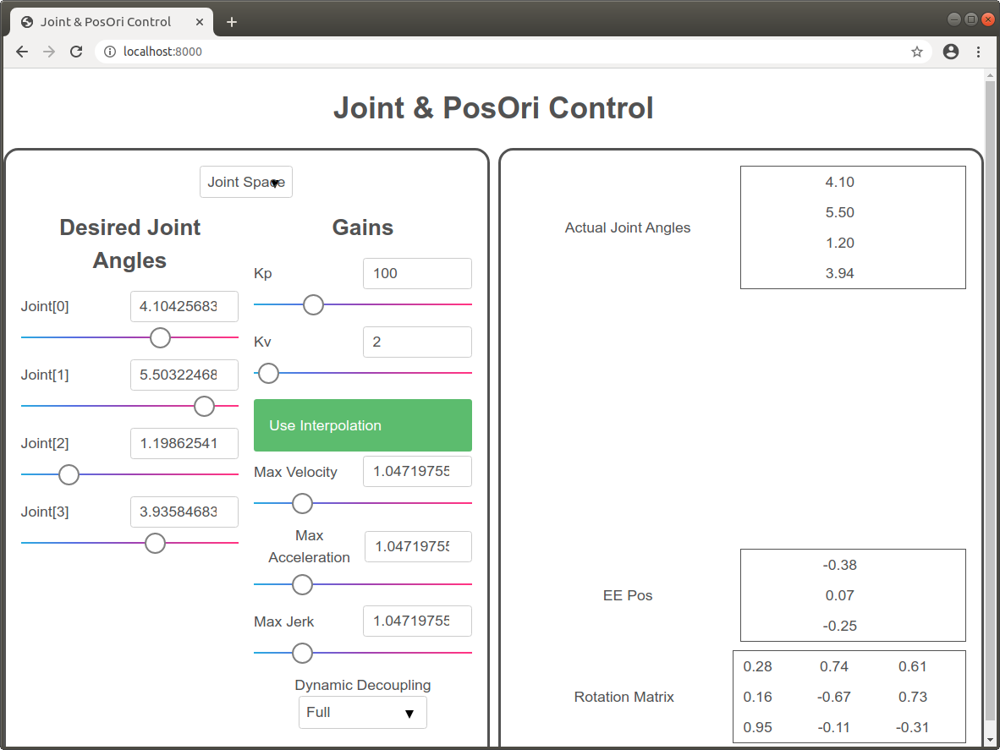
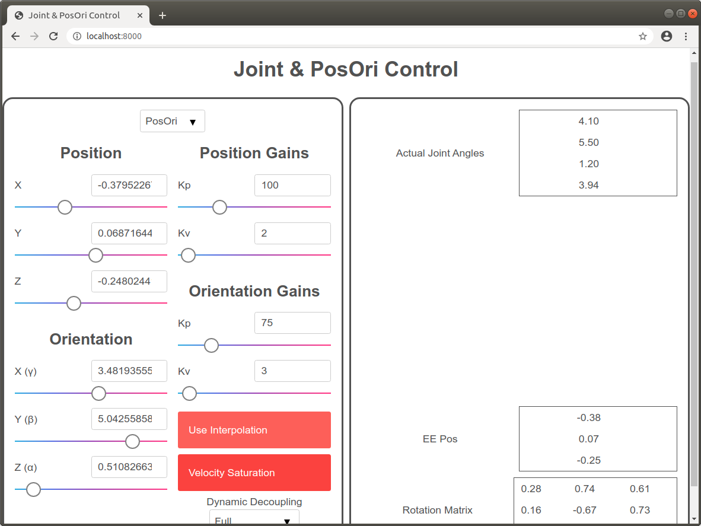

Joint & PosOri Settings Tutorial
================================

In the [previous tutorial](../02-joint-posori/README.md), we added an interface to control our robot's 
end-effector position and orientation. However, there are different settings
that modify how our robot gets to the user-set desired joint angles or position
or orientation. 

For the joint space task, we have the following settings:
* `sai2::interfaces::tutorial::joint_use_interpolation`: 
The default response to a change in desired joint position is a step response, which is not realistic. Set this setting to
1 for a smoother transition. 
* `sai2::interfaces::tutorial::joint_interpolation_max_vel`: If interpolation is enabled, sets the maximum velocity.
* `sai2::interfaces::tutorial::joint_interpolation_max_accel`: If interpolation is enabled, sets the maximum acceleration. 
* `sai2::interfaces::tutorial::joint_interpolation_max_jerk`: If interpolation is enabled, sets the maximum jerk.
* `sai2::interfaces::tutorial::joint_dynamic_decoupling`:
Specifies which dynamic decoupling mode to use. Can be `full`, `inertia_saturation`, or `none`.

For the posori task, we have the following settings:
* `sai2::interfaces::tutorial::posori_use_interpolation`: The default response to a change in desired end effector position is a step response, which is not realistic. Set this setting to
1 for a smoother transition. 
* `sai2::examples::posori_interpolation_max_linear_vel`: If interpolation is enabled, sets the maximum linear velocity.
* `sai2::examples::posori_interpolation_max_linear_accel`: If interpolation is enabled, sets the maximum linear acceleration.
* `sai2::examples::posori_interpolation_max_linear_jerk`: If interpolation is enabled, sets the maximum linear jerk.
* `sai2::examples::posori_interpolation_max_angular_vel`: If interpolation is enabled, sets the maximum angular velocity.
* `sai2::examples::posori_interpolation_max_angular_accel`: If interpolation is enabled, sets the maximum angular acceleration.
* `sai2::examples::posori_interpolation_max_angular_jerk`: If interpolation is enabled, sets the maximum angular jerk.
* `sai2::interfaces::tutorial::posori_dynamic_decoupling`: 
Specifies which dynamic decoupling mode to use. Can be `full`, `partial`, `inertia_saturation`, or `none`.
* `sai2::interfaces::tutorial::posori_use_velocity_saturation`: Outside of interpolation, the SAI framework has support to set limits of the end effector velocity. Set this to 1 to enable this setting.
* `sai2::interfaces::tutorial::posori_linear_velocity_saturation`: If velocity saturation is enabled, sets the maximum linear velocity.
* `sai2::interfaces::tutorial::posori_angular_velocity_saturation`: If velocity saturation is enabled, sets the maximum angular velocity.


We will be adding each of these options underneath the gains for each mode.

First, run the attached [writekeys.py](./writekeys.py) script:
```
wjen@wjen-desktop:~/sai2/core/sai2-interfaces$ python3 tutorials/03-settings/writekeys.py 4
sai2::interfaces::tutorial::mode set to b'joint'
sai2::interfaces::tutorial::q set to b'[4.104256839618732, 5.503224681078051, 1.198625419258891, 3.935846835181579]'
sai2::interfaces::tutorial::joint_kp set to b'100'
sai2::interfaces::tutorial::joint_kv set to b'2'
sai2::interfaces::tutorial::joint_use_interpolation set to b'0'
sai2::interfaces::tutorial::joint_interpolation_max_vel set to b'1.0471975511965976'
sai2::interfaces::tutorial::joint_interpolation_max_accel set to b'1.0471975511965976'
sai2::interfaces::tutorial::joint_interpolation_max_jerk set to b'1.0471975511965976'
sai2::interfaces::tutorial::joint_dynamic_decoupling set to b'full'
sai2::interfaces::tutorial::ee_pos set to b'[1.3253814642260253, 1.79904355793784, 0.49475150957534253]'
sai2::interfaces::tutorial::ee_ori set to b'[3.4819355526218665, 5.042558580451044, 0.5108266324373693]'
sai2::interfaces::tutorial::ee_pos_kp set to b'100'
sai2::interfaces::tutorial::ee_pos_kv set to b'2'
sai2::interfaces::tutorial::ee_ori_kp set to b'75'
sai2::interfaces::tutorial::ee_ori_kv set to b'3'
sai2::interfaces::tutorial::ee_rotmat set to b'[[0.046179533264880224, -0.19662701315121728, 0.9793902533753687], [0.8729927955558069, 0.48449520816139363, 0.0561067926039705], [-0.48554199572755286, 0.8524096497388324, 0.19402772847463373]]'
sai2::interfaces::tutorial::posori_use_interpolation set to b'0'
sai2::interfaces::tutorial::posori_interpolation_max_linear_vel set to b'1.0471975511965976'
sai2::interfaces::tutorial::posori_interpolation_max_linear_accel set to b'1.0471975511965976'
sai2::interfaces::tutorial::posori_interpolation_max_linear_jerk set to b'1.0471975511965976'
sai2::interfaces::tutorial::posori_interpolation_max_angular_vel set to b'1.0471975511965976'
sai2::interfaces::tutorial::posori_interpolation_max_angular_accel set to b'1.0471975511965976'
sai2::interfaces::tutorial::posori_interpolation_max_angular_jerk set to b'1.0471975511965976'
sai2::interfaces::tutorial::posori_dynamic_decoupling set to b'full'
sai2::interfaces::tutorial::posori_use_velocity_saturation set to b'0'
sai2::interfaces::tutorial::posori_linear_velocity_saturation set to b'1.0471975511965976'
sai2::interfaces::tutorial::posori_angular_velocity_saturation set to b'1.0471975511965976'
```

## Joint Modifications

Using `sai2-interfaces-accordion` is perfect for the interpolation option - we
only want to show and modify the sliders for interpolation only when interpolation
is enabled. We arbitrarily set the min and max to be from 0 to 5. 
```
<sai2-interfaces-accordion key="sai2::interfaces::tutorial::joint_use_interpolation"
  displayName="Use Interpolation">
  <sai2-interfaces-slider key="sai2::interfaces::tutorial::joint_interpolation_max_vel"
    display="Max Velocity" min="0.1" max="5" step="0.01">
  </sai2-interfaces-slider>
  <sai2-interfaces-slider key="sai2::interfaces::tutorial::joint_interpolation_max_accel"
    display="Max Acceleration" min="0.1" max="5" step="0.01">
  </sai2-interfaces-slider>
  <sai2-interfaces-slider key="sai2::interfaces::tutorial::joint_interpolation_max_jerk"
    display="Max Jerk" min="0.1" max="5" step="0.01">
  </sai2-interfaces-slider>
</sai2-interfaces-accordion>
```

We want to use `sai2-interfaces-enum` for selecting the dynamic decoupling mode
since there are a discrete set of values.
```
<sai2-interfaces-enum key="sai2::interfaces::tutorial::joint_dynamic_decoupling" 
  display="Dynamic Decoupling">
  <option value="full">Full</option>
  <option value="inertia_saturation">Inertia Saturation</option>
  <option value="none">None</option>
</sai2-interfaces-enum>
```

## PosOri Modifications

The posori interpolation option is exactly the same as joint interpolation, but with
a few more keys. We arbitrarily set the min and max to be from 0 to 5. 
```
<sai2-interfaces-accordion displayName="Use Interpolation" key="sai2::interfaces::tutorial::posori_use_interpolation">
  <sai2-interfaces-slider key="sai2::interfaces::tutorial::posori_interpolation_max_linear_vel" 
    display="Max Linear Vel" min="0", max="5", step="0.01">
  </sai2-interfaces-slider>
  <sai2-interfaces-slider key="sai2::interfaces::tutorial::posori_interpolation_max_linear_accel" 
    display="Max Linear Accel" min="0", max="5", step="0.01">
  </sai2-interfaces-slider>
  <sai2-interfaces-slider key="sai2::interfaces::tutorial::posori_interpolation_max_linear_jerk" 
    display="Max Linear Jerk" min="0", max="5", step="0.01">
  </sai2-interfaces-slider>
  <sai2-interfaces-slider key="sai2::interfaces::tutorial::posori_interpolation_max_angular_vel" 
    display="Max Angular Vel" min="0", max="5", step="0.01">
  </sai2-interfaces-slider>
  <sai2-interfaces-slider key="sai2::interfaces::tutorial::posori_interpolation_max_angular_accel" 
    display="Max Angular Accel" min="0", max="5", step="0.01">
  </sai2-interfaces-slider>
  <sai2-interfaces-slider key="sai2::interfaces::tutorial::posori_interpolation_max_angular_jerk" 
    display="Max Angular Jerk" min="0", max="5", step="0.01">
  </sai2-interfaces-slider>
</sai2-interfaces-accordion><br>
```

Velocity saturation is very similar to the interpolation: we only want to expose
the velocity saturation keys only if it is enabled. We arbitrarily set the min and max to be from 0 to 5. 
```
<sai2-interfaces-accordion displayName="Velocity Saturation"
  key="sai2::interfaces::tutorials::use_posori_velocity_saturation">
  <sai2-interfaces-slider key="sai2::interfaces::tutorial::posori_linear_velocity_saturation"
    display='Max Linear Velocity' min="0" max="5" step="0.01">
  </sai2-interfaces-slider>
  <sai2-interfaces-slider key="sai2::interfaces::tutorial::posori_angular_velocity_saturation"
    display='Max Angular Velocity' min="0" max="5" step="0.01">
  </sai2-interfaces-slider>
</sai2-interfaces-accordion>
```

We want to use `sai2-interfaces-enum` for selecting the dynamic decoupling mode
since there are a discrete set of values.
```
<sai2-interfaces-enum key="sai2::interfaces::tutorial::posori_dynamic_decoupling" 
  display="Dynamic Decoupling">
  <option value="full">Full</option>
  <option value="partial">Partial</option>
  <option value="inertia_saturation">Inertia Saturation</option>
  <option value="none">None</option>
</sai2-interfaces-enum>
```

## The Finished Interface

See [03-settings.html](./03-settings.html) for the completed interface. 
Run the server:
```
python3 interface/server.py tutorials/03-settings/03-settings.html
```

You should see the following:



