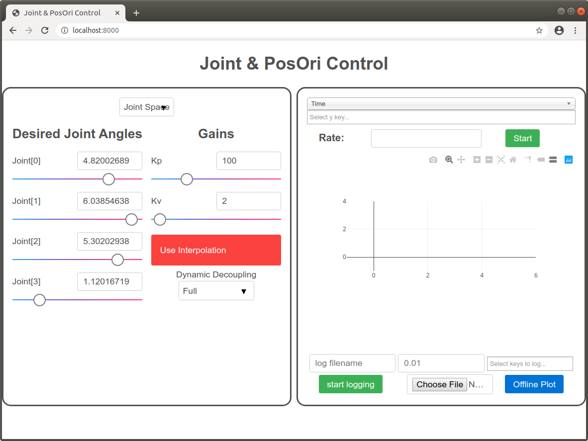
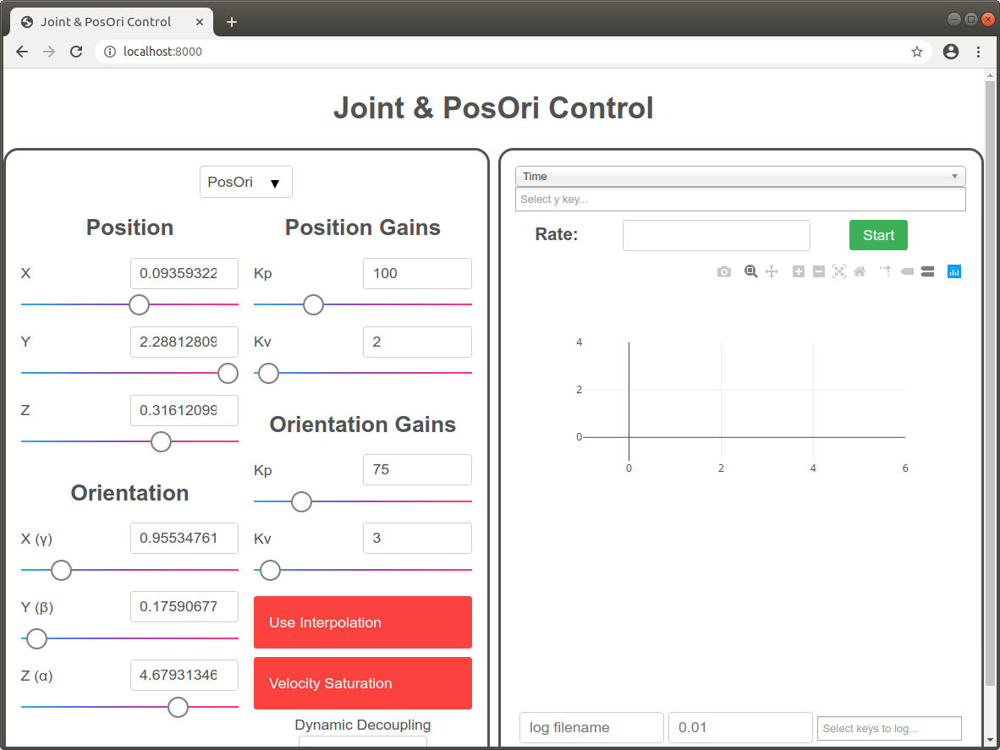
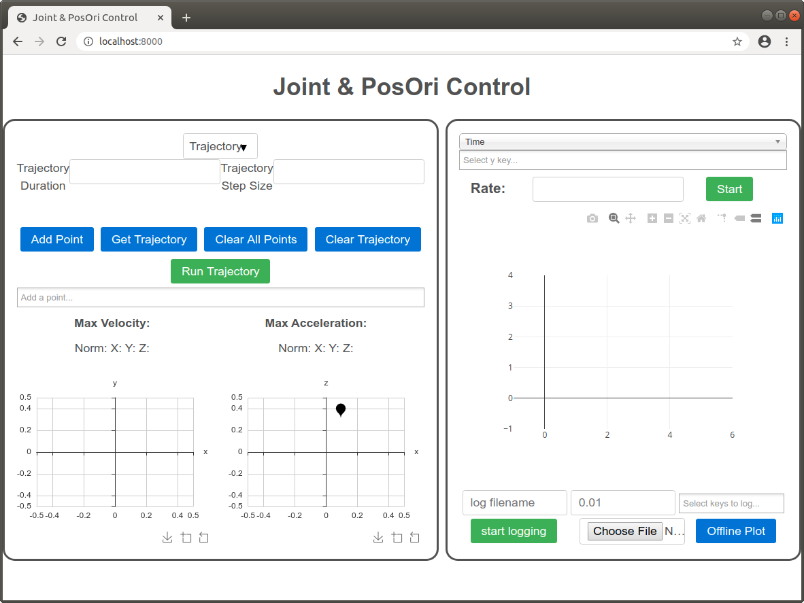

Trajectory Select, Plot, and Logger
===================================

For the final tutorial, we are going to add another mode: the trajectory select mode. We will also be adding a plot and logger to the right half side of the interface.

We introduce a new key required for the trajectory select module: `sai2::interfaces::tutorial::ee_vel`, which represents the end effector velocity.

First, run the attached [writekeys.py](./writekeys.py) script:
```
wjen@wjen-desktop:~/sai2/core/sai2-interfaces$ python3 tutorials/04-traj-plot-logger/writekeys.py 4
sai2::interfaces::tutorial::mode set to b'joint'
sai2::interfaces::tutorial::q set to b'[4.82002689689863, 6.038546386821016, 5.302029387591558, 1.1201671923919794]'
sai2::interfaces::tutorial::joint_kp set to b'100'
sai2::interfaces::tutorial::joint_kv set to b'2'
sai2::interfaces::tutorial::joint_use_interpolation set to b'0'
sai2::interfaces::tutorial::joint_interpolation_max_vel set to b'1.0471975511965976'
sai2::interfaces::tutorial::joint_interpolation_max_accel set to b'1.0471975511965976'
sai2::interfaces::tutorial::joint_interpolation_max_jerk set to b'1.0471975511965976'
sai2::interfaces::tutorial::joint_dynamic_decoupling set to b'full'
sai2::interfaces::tutorial::ee_pos set to b'[0.09359322456682317, 2.28812809207947, 0.31612099014034667]'
sai2::interfaces::tutorial::ee_ori set to b'[0.9553476197289215, 0.17590677257335038, 4.679313462836639]'
sai2::interfaces::tutorial::ee_pos_kp set to b'100'
sai2::interfaces::tutorial::ee_pos_kv set to b'2'
sai2::interfaces::tutorial::ee_ori_kp set to b'75'
sai2::interfaces::tutorial::ee_ori_kv set to b'3'
sai2::interfaces::tutorial::ee_rotmat set to b'[[0.28281587330545144, 0.7363234828899434, 0.6146892795155112], [0.1585025975751074, -0.667918876116621, 0.7271597496348746], [0.9459873722034657, -0.1082224721207807, -0.305607244939724]]'
sai2::interfaces::tutorial::posori_use_interpolation set to b'0'
sai2::interfaces::tutorial::posori_interpolation_max_linear_vel set to b'1.0471975511965976'
sai2::interfaces::tutorial::posori_interpolation_max_linear_accel set to b'1.0471975511965976'
sai2::interfaces::tutorial::posori_interpolation_max_linear_jerk set to b'1.0471975511965976'
sai2::interfaces::tutorial::posori_interpolation_max_angular_vel set to b'1.0471975511965976'
sai2::interfaces::tutorial::posori_interpolation_max_angular_accel set to b'1.0471975511965976'
sai2::interfaces::tutorial::posori_interpolation_max_angular_jerk set to b'1.0471975511965976'
sai2::interfaces::tutorial::posori_dynamic_decoupling set to b'full'
sai2::interfaces::tutorial::posori_use_velocity_saturation set to b'0'
sai2::interfaces::tutorial::posori_linear_velocity_saturation set to b'1.0471975511965976'
sai2::interfaces::tutorial::posori_angular_velocity_saturation set to b'1.0471975511965976'


```

## Trajectory Select
Since this is a new mode, we can just add a new `sai2-interfaces-select-option`
to the `sai2-interface-select`:
```
<sai2-interfaces-select-option name="Trajectory" key="trajectory">
  <sai2-interfaces-trajectory-select xLim="[-0.5,0.5]" yLim="[-0.5,0.5]" zLim="[-0.5,0.5]"
    current_pos_key="sai2::interfaces::tutorial::ee_pos" primitive_key="sai2::interfaces::tutorial::mode"
    primitive_value="trajectory" position_key="sai2::interfaces::tutorial::ee_pos"
    velocity_key="sai2::interfaces::tutorial::ee_vel">
  </sai2-interfaces-trajectory-select>
</sai2-interfaces-select-option>
```

## Plot and Logger
We will remove the `sai2-interface-display` elements. They are nice, but what's
usually more useful is to have a plotting and logging facility baked in. 
Since these elements don't require any attributes, it's actually quite easy
to implement:
```
<div class="container-item right-container">
  <sai2-interfaces-plot></sai2-interfaces-plot>
  <sai2-interfaces-logger></sai2-interfaces-logger>
</div>
```

## The Finished Interface
See [04-traj-plot-logger.html](./04-traj-plot-logger.html) for the completed interface. If you run the server, you should get the following:



